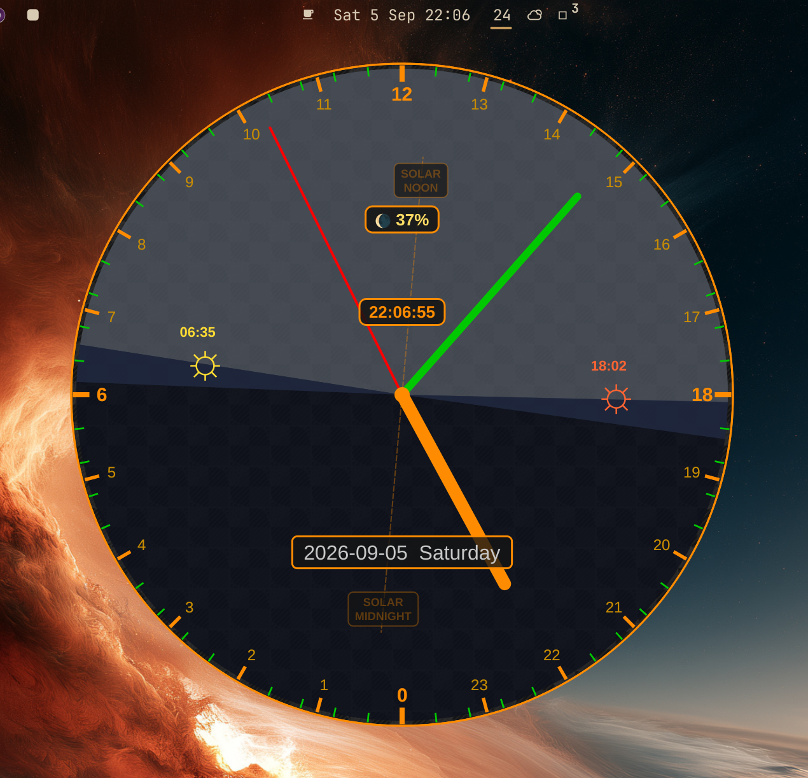

# Clock24 — 24-hour solar clock for Omarchy

A 24-hour analog clock as an Omarchy **bar widget**. The bar shows a small
`24` pill; clicking it opens a popup clock face that plots the day as a ring:
midnight at the bottom, sunrise and sunset on the left and right, noon at the
top, the current time on a sweep hand.



## Features

- Analog 24-hour dial with hour/minutes/secs, sweep-hand and static hands
- Sunrise / sunset hands and the day's light-arc band, recalculated daily
  for your location
- Solar noon axis drawn from the actual solar-noon offset for your
  longitude/timezone
- Location fully configurable from the widget's `shell.json` entry
  (`latitude`, `longitude`, `timeZoneOffset`) so the solar geometry is correct
  anywhere on Earth
- Self-contained `Clock24/` QML module (C++ core), no runtime scripts
- Outside-click dismissal and the shell's popout coordinator integration
- IPC target (`omarchy-shell kosovim-dev.clock24 toggle …`)

## Requirements

- Omarchy shell (Quickshell-based bar) on a Qt 6 environment
- CMake ≥ 3.16, Ninja, a C++17 compiler
- Qt 6 with `Quick` and `Qml` development files

## Build & install

```sh
git clone https://github.com/kosovim-dev/omarchy-clock24
cd omarchy-clock24
./scripts/build.sh
```

`build.sh` configures and builds the CMake project, then installs the plugin
into `~/.config/omarchy/plugins/kosovim-dev.clock24/`:

```
kosovim-dev.clock24/
├── manifest.json       Omarchy plugin manifest (kind: bar-widget)
├── BarWidget.qml       Entry point: the "24" bar pill
├── Panel.qml           Popup content hosting the Clock24 item
└── Clock24/            Self-contained QML module (qmldir + shared libs)
```

Only files under `plugin/` and `src/` are the plugin proper — everything else
is build scaffolding. There is no separate packaging step; the installed
directory is the plugin.

## Setup & configuration

The `Clock24` QML module is resolved through `QML_IMPORT_PATH`. Export it from
`~/.config/uwsm/env` so it is present when the shell starts:

```sh
# ~/.config/uwsm/env
export QML_IMPORT_PATH=$HOME/.config/omarchy/plugins/kosovim-dev.clock24
```

Add the widget to a bar slot in `~/.config/omarchy/shell.json` — the plugin id
and its configuration live in the same entry, e.g. `bar.layout.center`:

```json
{
  "bar": {
    "layout": {
      "center": [
        { "id": "omarchy.clock" },
        { "id": "kosovim-dev.clock24", "latitude": 51.5072, "longitude": -0.1276, "timeZoneOffset": 1.0 },
        { "id": "kosovim-dev.todo" }
      ]
    }
  }
}
```

All three parameters are optional and fall back to Melbourne, Australia
(−37.8136, 144.9631, UTC+10):

| Key               | Type   | Default     | Meaning                                |
|-------------------|--------|-------------|----------------------------------------|
| `latitude`        | number | `-37.8136`  | Geodetic latitude, decimal degrees     |
| `longitude`       | number | `144.9631`  | Longitude, decimal degrees             |
| `timeZoneOffset`  | number | `10.0`      | Offset from UTC in hours (incl. DST)   |

`timeZoneOffset` shifts the solar-noon axis; latitude/longitude drive the
sunrise/sunset calculations and light-arc geometry.

Saving `shell.json` hot-reloads the bar; the widget appears once the plugin
directory is in place and `QML_IMPORT_PATH` is set (a re-login picks up the
new `uwsm/env`).

> **Note:** after the first install you will need to log out and back in (or
> reboot) before the plugin will function — `QML_IMPORT_PATH` from `uwsm/env`
> is read when the compositor session starts, so it only reaches the shell
> after a fresh session.

## Controlling the popup

The bar-widget root exposes `open()`, `close()`, and `opened`, so the bar's
summon/hide/toggle routing works, and it registers an `IpcHandler`:

```sh
omarchy-shell kosovim-dev.clock24 open     # show the popup
omarchy-shell kosovim-dev.clock24 close    # hide the popup
omarchy-shell kosovim-dev.clock24 toggle   # flip it
```

## License

MIT — see [LICENSE](LICENSE).

Solar calculations come from `src/SunRise.{h,cpp}` (by Cyrus Rahman, subject
to Stephen Schmitt's copyright). Redistribution of that code must retain its
copyright notice, which is preserved in the sources.
